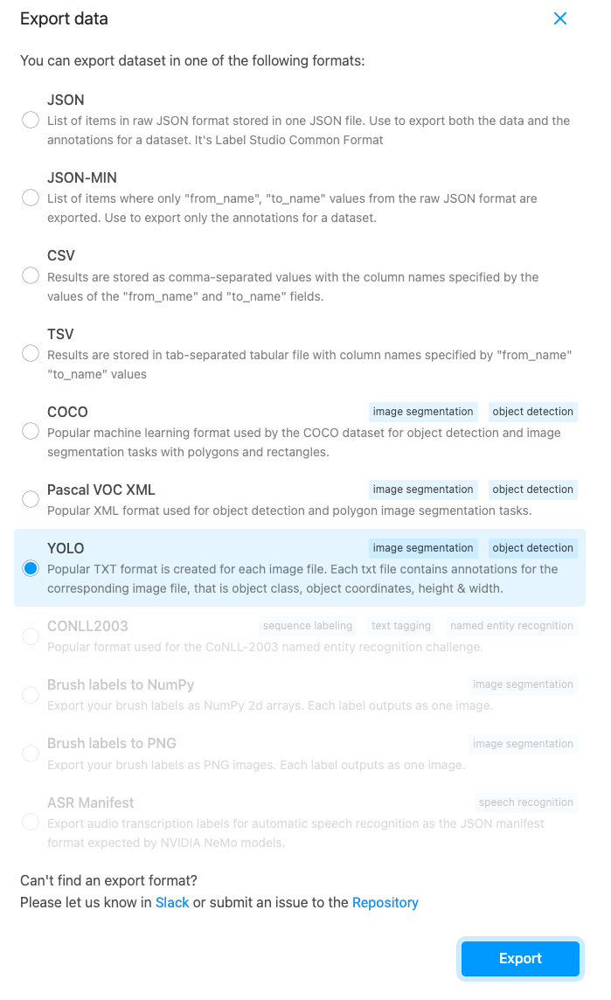

## Introduction

## Steps:

### 1. Resize images

Before we start labeling the images, we need to resize them to a resolution to `640 x 640`  to make sure images having the same size. (This is for prevent issue occurs with yolo model training)
```bash
python resize_images.py -d images/ -s 640 640
```

### 2. Annotate images with labelstudio 
By using labelstudio, we can label the images with bounding boxes. 

and then export the data with YOLO options.



#### 3. Upload data in `drive-data` to google drive
`drive-data` folder contains the data that we need to train the model.
- `dataset.yml` is the configuration file for the dataset (Predefined manually )
- `data` folder contains the images and labels that we annotated in labelstudio

- create a folder in google drive and upload `drive-data` to that folder.
- after that, change the dataset path in `train-yolov8.ipynb` to the path of the folder that we just created.

#### 4. Train the model on google colab

